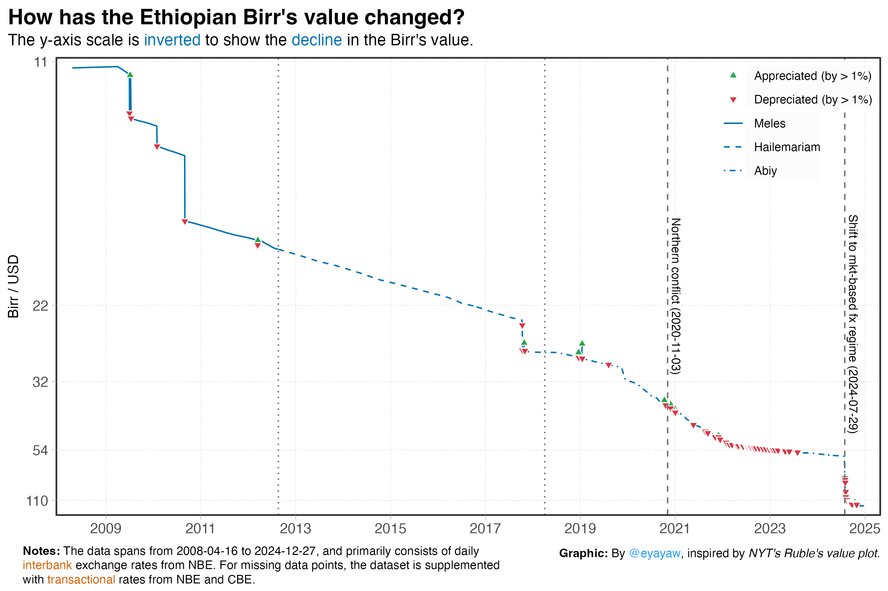

# **Random Viz**

- [Birr’s value decline against USD](#birrs-value-decline-against-usd)

<!-- README.md is generated from README.qmd. Please edit that file -->

## Birr’s value decline against USD

> [View
> Code](birr-devaluation/birr_value_ts_plot.R)

